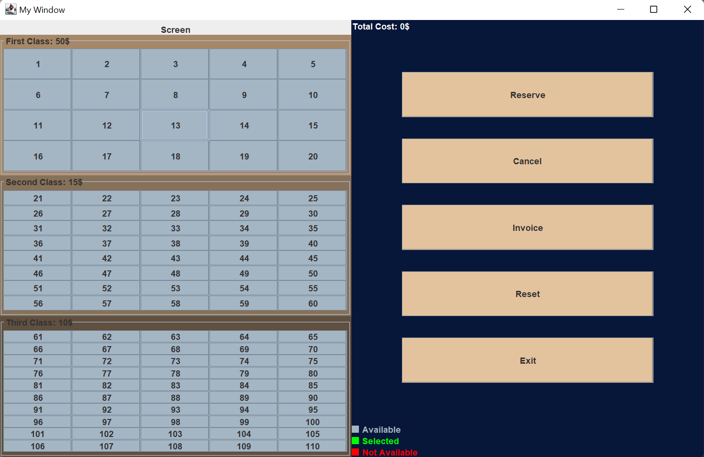
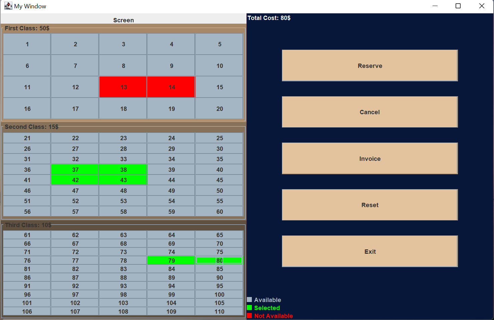
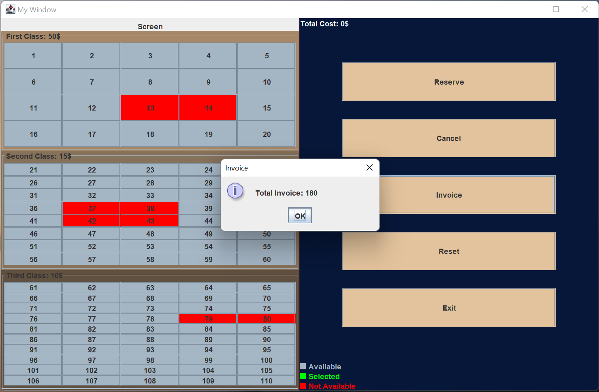

# Cinema Reservation Screen (Java Swing)

This program enables users to reserve seats in a cinema with three classes of reservations: First, Second, and Third class. Each class has specific seating arrangements and ticket costs.

## Classes and Seating Arrangements

1. **First Class**: 20 seats (4 rows x 5 columns), ticket cost: 50 L.E.  
2. **Second Class**: 40 seats (8 rows x 5 columns), ticket cost: 15 L.E.  
3. **Third Class**: 50 seats (10 rows x 5 columns), ticket cost: 10 L.E.  

## Functionality

1. **Ticket Reservation**: Users can reserve seats by following these steps:  
   - Click on the seat they want to reserve.  
   - View the current status of available seats.  
   - The system calculates the total amount to be paid live while selecting seats.  

2. **Invoice**: Displays the total revenue.  

3. **Reset the Cinema Reservations**: Clears all reservations and sets all seats to empty.  

4. **Exit**: Terminates the program.  

## Usage

To use the program, follow the on-screen prompts and click on the seat you want to reserve.

## Screenshots

Here are a few screenshots showcasing the design of the application:

1. **Main Screen**  
   

2. **Seat Selection**  
   

3. **Invoice Screen**  
   

## Purpose

This program was created as a project for the **Advanced Programming** course at university. It applies advanced OOP concepts and demonstrates the use of Java Swing for building interactive GUIs.

## Author

This program was created by **AbdelRahman AlSammany**.

## Version History

- **Version 1.0**: Initial release (18/05/2024)  

**Note: This is a beta release. Feedback and suggestions are welcome!**
